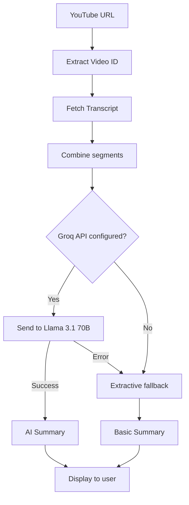

# Groq AI Integration - Walkthrough

## What Was Done

Successfully integrated **Groq API** with **Llama 3.1 70B** model to generate detailed, structured summaries from YouTube video transcripts. Groq provides ultra-fast inference with a generous free tier.

## Changes Made

### 1. Dependencies
- Installed `groq-sdk` package for Groq API integration
- Removed `@google/generative-ai` (Gemini had API compatibility issues)

### 2. Configuration

#### [.env.example](file:///c:/Users/sakib/.gemini/antigravity/scratch/youtube_summarizer/.env.example)
- Updated to use `GROQ_API_KEY` instead of `GEMINI_API_KEY`
- Added link to Groq Console for API key generation

### 3. API Route

#### [route.ts](file:///c:/Users/sakib/.gemini/antigravity/scratch/youtube_summarizer/app/api/summarize/route.ts)

**Key changes:**
- **Groq initialization** (lines 3-8): Imports and initializes Groq SDK
- **AI summary function** (lines 110-156): Uses Groq's chat completions API with Llama 3.1 70B
- **Model selection**: `llama-3.1-70b-versatile` - fast, high-quality, and free
- **Smart parameters**: Temperature 0.5 for balanced creativity, max 2048 tokens
- **Fallback mechanism**: Automatically uses extractive summarization if Groq fails

## How It Works

## Groq Advantages

✅ **Ultra-fast**: One of the fastest inference platforms available  
✅ **Free tier**: Generous rate limits for personal use  
✅ **High quality**: Llama 3.1 70B is a powerful, instruction-tuned model  
✅ **Reliable**: Stable API with good uptime  
✅ **Easy setup**: Simple SDK, straightforward authentication

## Next Steps

> [!IMPORTANT]
> You need to add your Groq API key to use AI summaries

1. **Get API key**: Visit [Groq Console](https://console.groq.com/keys)
2. **Add to .env**: Create/edit `.env` file and add `GROQ_API_KEY=your_key_here`
3. **Restart server**: Stop and restart `npm run dev`
4. **Test it**: Try summarizing a YouTube video!

See [SETUP.md](file:///C:/Users/sakib/.gemini/antigravity/brain/50537569-c239-46f5-b842-296f26a4892e/SETUP.md) for detailed setup instructions.

## Testing

Your dev server is running. Once you add your Groq API key:

1. Open the app in your browser
2. Paste a YouTube URL (educational or technical videos work best)
3. Click "Summarize"
4. Expect a detailed, well-structured summary in seconds

The response includes a `method` field showing whether AI or extractive summarization was used.

## Fallback Behavior

If Groq API fails or isn't configured, the app automatically falls back to the extractive summarization algorithm, ensuring the app always works.
